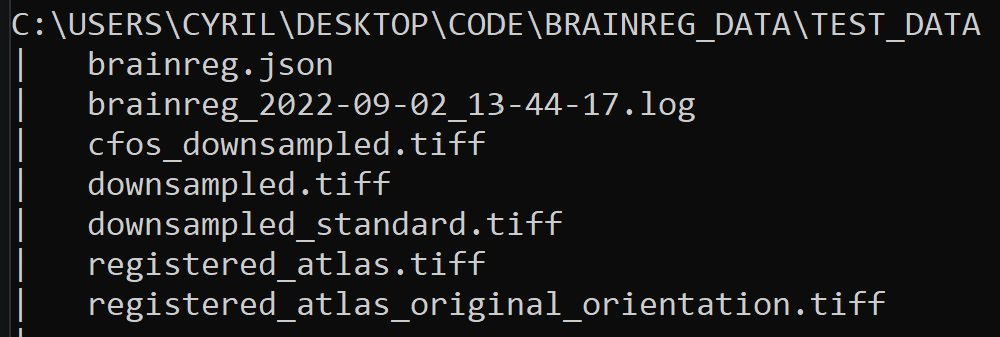
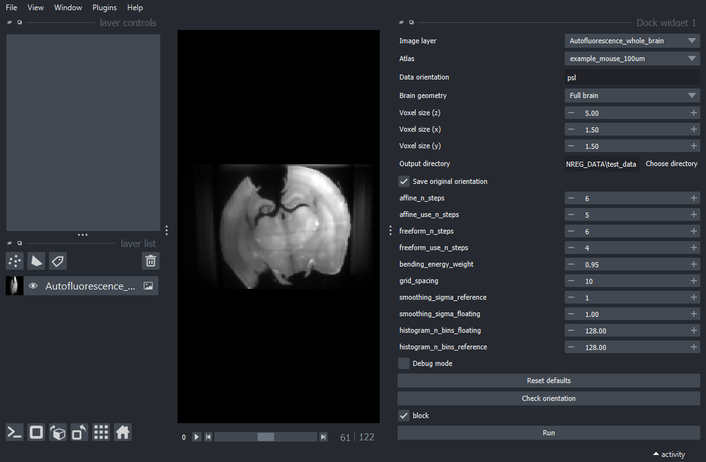
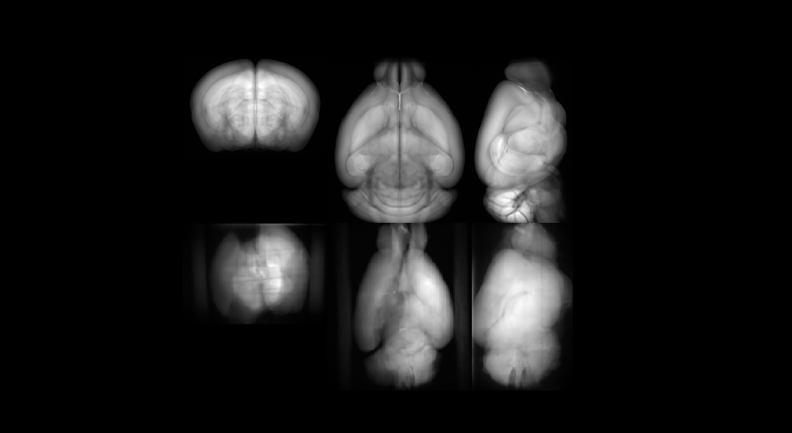

# Running the pipeline

The pipeline can be separated in two main data processing components:

- The brain registration (registration, using **brainreg**)
- The cell segmentation (cellseg, using **cellseg3d**)

These are technically independent, but for the purpose of this pipeline they are arranged in dependent tables[^ERD].

The brain registration runs on **a whole brain imaged with autofluorescence**,
whereas cellseg runs on **cropped images with cFOS staining** (from a whole brain scan).

```{figure} ./images/autofluo.png
---
name: autofluo-fig
---
**Example of an autofluorescence scan** Note the consistent color, no regions are really brighter.
*This is ideal for brainreg*.
```

```{figure} ./images/cfos_whole.png
---
name: cfos-fig
---
**Example of a cFOS scan** Note the brighter regions. On the high-res version you'd be able to see ***individual neurons***.
*This is what cellseg has been trained on (cropped regions of it) and is critical for proper segmentation.*
```

```{figure} ./images/cfos_brightened.png
---
name: cfos-bright-fig
---
Same cFOS scan with different contrast. Brighter regions have more labeled cells.
```
This means that in order to test the whole pipeline, you'd need two whole scans of the same brain with different imaging modalities.

```{note}
We do not have, as of yet, a set of those two imaging techniques for the ***same*** brain.
As such I've been using two different brains.
It is still possible to check if the results are correct despite this, to a certain extent.
```

# Populating tables

## Scan

The pipeline originally requires those two scan files to be initialised; the *Scan* table also depends on the *Mouse* and *User* tables. [^ERD]

A *Scan* tables needs:
- A *Mouse*
- An attempt id (unique number for each pipeline run)
- A *User* (to send report to, has yet to be implemented fully, code is ready but not the table itself)
- An autofluorescence scan
- A cFOS scan
- A timestamp in YYYY-MM-DD h:m:s format (e.g. *2022-01-01 16:03:15*)
- A list of regions of interest to extract from the brain registration (e.g. ```[656, 972]```. See [regions reference](brainreg_atlas_ref.ipynb))

Here is an example of code to create and insert test Mouse, User and Scan tables :

```
SCAN_PATH = Path.home() / ... # path to test data

mice.Mouse().insert1(("mouse", 0, "2022-01-01", "U", "WT"), skip_duplicates=True)
user.User().insert1(("cyril", "cyril.achard@epfl.ch"), skip_duplicates=True)

test_scan = spim.Scan()

cfos_path = SCAN_PATH / Path("cfos_downsampled.tiff")
autofluo_path = SCAN_PATH / Path("downsampled.tiff")
time = "2022-01-01 16:16:16" # can use datetime with formatting if you want

test_scan.insert1(
    (
        "mouse",
        0,
        "cyril",
        autofluo_path,
        cfos_path,
        time,
        [656, 962, 767]  # id of region, refer to scripts.brainreg_utils.get_atlas_ref_df.
        # See Brain regions reference in the sidebar
    ),
    skip_duplicates=True,
)
```

Once this is done, you may call the ```populate()``` methods of all downstream tables, as they are computed automatically
from the given scan files.

## BrainRegistration
```
spim.BrainRegistration().populate()
```
Opens napari with the brainreg plugin, waiting for user to run brainreg on the Scan file. See [brainreg notes](content:references:brainreg_notes)
Also see [brainreg documentation online](https://docs.brainglobe.info/brainreg-napari/introduction).

```{warning}
**Brainreg should run fully before you close the viewer. Only close the viewer once the results folder has been properly populated.**
```

```{note}
Brainreg creates an output folder that always has at least the following files, excluding cfos_downsampled.tiff:

```

The pipeline needs minimally from this folder:
- downsampled.tiff : downsampled original autofluorescence scan, downscaled to fit atlas standards
- brainreg.json : log of parameters. Used by the pipeline to save this data in the Brainreg table
- registered_atlas.tiff: labels for each region. Used to find the corresponding regions in the cFOS scan

Once brainreg is done, the ROIs are calculated automatically for each provided region index.

## SemanticSegmentation
```
spim.SemanticSegmentation().populate()
```
Runs the cellseg3d chosen model on every cropped ROI from the brainreg.
```{note}
All the config for cellseg is in ***cellseg3dmodule/inference_config.json***. Please see [related cellseg3d documentation](https://adaptivemotorcontrollab.github.io/CellSeg3d/res/guides/inference_module_guide.html)
```

## InstanceSegmentation
```
spim.InstanceSegmentation().populate()
```
Runs instance segmentation on the semantic segmentation. This is done through "classic" image processing techniques, not models.
It can happen that cells that are very close get fused with this method.
I've been searching methods that would work better, e.g. from pycl-esperanto.
```{figure} ./images/instance_result.png
---
height: 300px
name: instance-fig
---
Example of a very small volume, with good instance labels and without anisotropy. Note the few fused cells.
```

## Analysis
```
spim.Analysis().populate()
```
Creates a .csv with object stats. For now stats are not very complete.
sI will add napari-nsr in the future to properly record all meaningful statistics.

```
# missing report for now, but the code to crop results, get stats and send an email is ready
```
(content:references:brainreg_notes)=
## Notes on running brainreg

- Atlas: I recommend using *allen_mouse_25um*.
- Orientation: very important for proper results. Use the "Check orientation" button in brainreg-napari to ensure proper orientation. See example below.
- Voxel size: brainreg can fail if this is not correct. Usually our images are $1.5 \times 1.5 \times 5$ microns in $X,Y,Z$

The napari popup should be something like this:

*Note the Check Orientation button, very useful*

When checking the orientation, the above row (reference) should mostly match the bottom row (input with user-specified orientation).
Here is an example with correct orientation:


(content:references:cellseg_notes)=
## Notes on running cellseg

- Window inference: With this detached version, there have been issues with the sliding window inference size.
I'd suggest keeping it fairly large to minimize issues (>128 if possible).
- Anisotropy : I had issues with how the brain is oriented when setting anisotropy in the SemanticSegmentation table.
Values are recovered from brainreg.json but it has been hard to find something that works consistently. Maybe use scripts.brainreg_utils.reorient_volume ?

[^ERD]: See the included [Plot ERD Diagrams](plot_ERD_mesospim.ipynb) Jupyter Notebook listed in the sidebar
